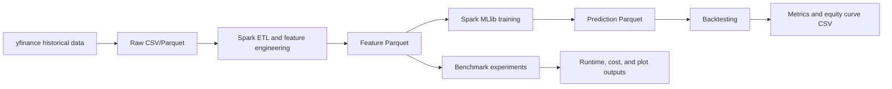
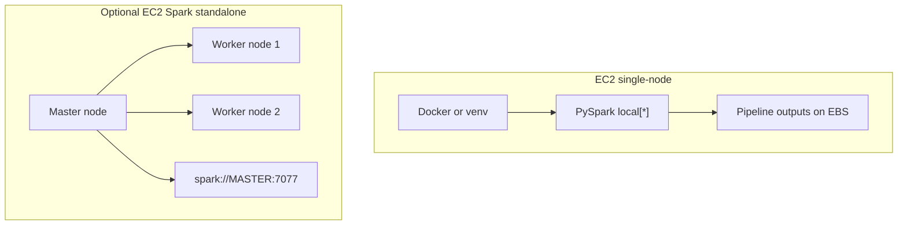

# Architecture

## System Overview

The platform is a batch cloud ML pipeline. Historical OHLCV data is downloaded once, processed with Spark, used to train Spark MLlib classifiers, then evaluated through a simple backtest and benchmark suite.

## Data Flow

The downloader writes long-form rows with `date`, `ticker`, OHLCV columns, and `adj_close`. Spark reads this data, repartitions by ticker, sorts within ticker/date windows, and builds technical indicators.

Features are saved as Parquet so training and benchmarking can reuse the same processed dataset. Predictions are also saved as Parquet because Spark vectors such as probabilities are easier to preserve in Parquet than CSV.

## Feature Design

The Spark pipeline uses ticker-partitioned windows ordered by date:

- `daily_return`: current close versus previous close.
- `ma5`, `ma10`, `ma20`: rolling averages ending at the current row.
- `rolling_volatility_20`: sample standard deviation of past/current daily returns.
- `volume_change`: current volume versus previous volume.
- `return_lag_1`, `return_lag_2`, `return_lag_3`, `return_lag_5`: previous returns.
- `label`: whether the configured future return is positive.

The label uses future data, but it is not included in the model feature vector. All model features are available at or before prediction date.

## Model Flow

Training uses a chronological split from `config/config.yaml`. The default split trains on data through `2024-01-01` and tests after that date. If this split does not produce both train and test rows, the code falls back to an ordered date split.

Implemented models:

- Moving-average baseline: predicts positive when `ma5 > ma20`.
- Spark Logistic Regression with vector assembly and standard scaling.
- Spark Random Forest with vector assembly.

## Backtest Flow

For each ticker/date prediction, the strategy is long when prediction is positive and in cash otherwise. Daily portfolio returns are equal-weight averages across tickers. Transaction cost is charged when a ticker position changes.

Reported metrics include cumulative return, annualized return, Sharpe ratio, max drawdown, win rate, accuracy, and F1. Buy-and-hold is reported with the same future return stream for comparison.

## Deployment Shape

Local and Docker runs use Spark local mode. EC2 runs can use local mode on one instance or standalone Spark mode across multiple EC2 nodes for a small cluster demonstration.

