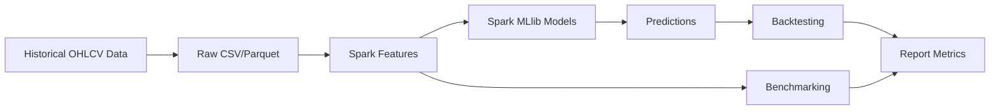

# Final Report Draft

## Motivation

Financial market forecasting is a useful domain for demonstrating cloud-native data and ML systems because it combines time-series data, feature engineering, model training, evaluation, and reproducible deployment. This project does not attempt to build a profitable trading system. It uses stock trend prediction as a practical workload for Spark-based distributed processing and cloud cost/performance evaluation.

## System Architecture

The system is a batch ML pipeline:

1. Download historical stock data from `yfinance`.
2. Store raw data as CSV and Parquet.
3. Use Spark DataFrames for ETL and feature engineering.
4. Train Spark MLlib classifiers.
5. Save predictions.
6. Run a transaction-cost-aware backtest.
7. Compare pandas and Spark runtime.
8. Package and deploy with Docker on AWS EC2.

## Dataset

The default dataset uses 10 liquid US equities from 2018 onward. The project supports a ticker file for larger runs such as 100 or 500 symbols. Data is downloaded through `yfinance`, which is suitable for educational and personal-use research but not a production data feed.

## Feature Engineering

Spark computes:

- Daily return.
- Moving averages over 5, 10, and 20 days.
- 20-day rolling volatility.
- Volume change.
- Lagged returns over 1, 2, 3, and 5 days.
- Future-return label for next-day classification.

The implementation avoids look-ahead bias by using rolling windows ending at the current row. The label is derived from a future close, but that label and future return are excluded from model features.

## ML Models

The baseline is a moving-average rule that predicts positive return when MA5 is above MA20. Main models are Spark MLlib Logistic Regression and Random Forest Classifier. Training uses chronological splitting rather than random splitting.

## Backtesting Method

The backtest simulates a simple long/cash strategy. A positive model prediction takes a long position for the next period; a negative prediction stays in cash. Transaction cost is charged when position changes. The result is compared against equal-weight buy-and-hold.

Metrics:

- Cumulative return.
- Annualized return.
- Sharpe ratio.
- Maximum drawdown.
- Win rate.
- Accuracy.
- F1 score.

## Cloud Deployment

The project is deployable on Ubuntu EC2 with Python, Java, Spark via PySpark, and Docker. The recommended student workflow starts with `t3.medium` for smoke tests and `t3.large` for larger experiments. A small standalone Spark cluster is documented as an optional extension.

## Performance Evaluation

The benchmark compares pandas and Spark local mode across ticker counts and Spark partition counts. The expected outcome is that pandas may win on tiny datasets, while Spark becomes more relevant as data size and parallelism increase. Runtime is converted into rough EC2 cost using configured hourly rates.

## Cost Analysis

Costs are controlled by using small burstable instances, limiting ticker counts during development, and stopping or terminating EC2 instances after experiments. The code never requires AWS credentials and the repository ignores key files and environment files.

## Limitations

- Yahoo Finance data through `yfinance` is not a production-grade market data source.
- Daily OHLCV data is too coarse for realistic execution modeling.
- The backtest uses a simplified equal-weight long/cash strategy.
- Transaction costs are simplified.
- Models are basic and are not expected to reliably predict markets.
- No hyperparameter optimization is included in the core scope.

## Future Work

- Add walk-forward validation.
- Add S3 input/output paths.
- Add Spark standalone cluster automation.
- Add simulated streaming inference.
- Add a small CLI or FastAPI interface after the core pipeline is stable.
- Add LSTM only as an optional comparison after Spark ML is complete.

